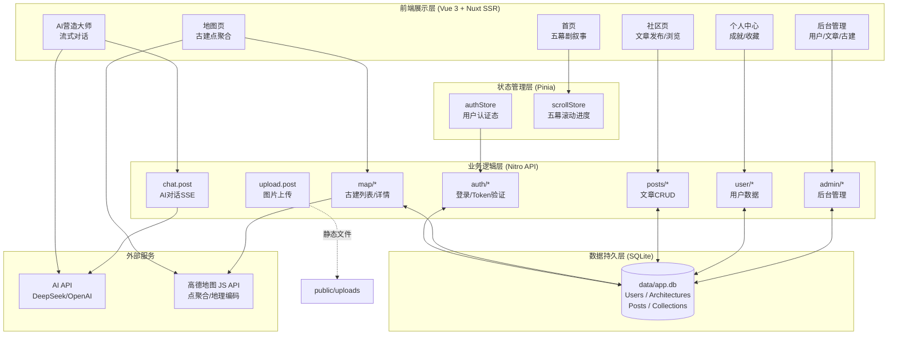
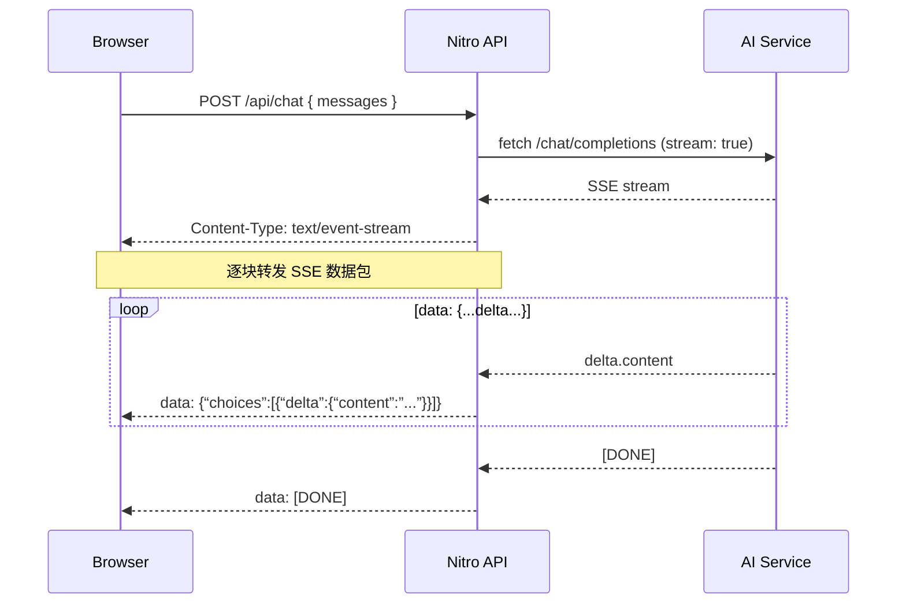
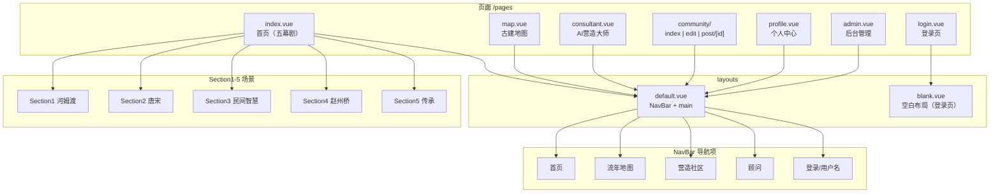

# 榫卯流年——中国古代木构建筑可视化系统 设计说明书

2026年4月8日

***

## 1 简介

### 1.1 作品创意/项目背景

榫卯是中国古代木构建筑的核心灵魂。本项目旨在打造一个以中国古代榫卯工艺为主题的信息可视化 Web 作品。项目以“一凹一凸，阴阳咬合”为叙事标语，通过“五幕剧”的叙事结构，讲述榫卯技艺从新石器时代河姆渡到当代参数化设计的七千年传承历程。

### 1.2 项目实施计划

1. **需求与策划阶段**：确定五幕剧叙事大纲，整理《全国重点文物保护单位》等古建数据。
2. **设计与原型阶段**：确立暗色系古风视觉，完成3D交互与页面UI设计。
3. **核心开发阶段**：完成前端视差滚动、3D渲染及地图开发，同步进行后端API与数据清洗。
4. **测试与优化阶段**：前后端联调，进行性能优化及移动端初步适配。

## 2 总体设计

### 2.1 系统功能

#### 2.1.1 功能概述

系统主要包含五幕剧沉浸叙事、榫卯古建地图、营造社区、AI营造大师以及营造司控制台（后台管理）五大核心模块。

\[图1 系统功能框架图]



#### 2.1.2 功能说明

- **五幕剧主内容**：通过横向滚动、3D交互与图表可视化，展示榫卯七千年发展史。
- **榫卯地图**：基于全国古建数据，提供点聚合展示、朝代筛选与深度定位。
- **营造社区**：提供富文本文章发布、阅览与用户互动功能。
- **AI营造大师**：基于LLM的垂直领域对话助手，解答建筑相关问题。
- **后台管理**：提供用户管理、文章风控审核及古建数据校对。

### 2.2 系统软硬件平台

#### 2.2.1 系统开发平台

- **前端**：Nuxt 4.3.1, Vue 3.5.28, Tailwind CSS, GSAP (动画), TresJS/Three.js (3D渲染), ECharts, 高德地图JSAPI。
- **后端**：Nitro, better-sqlite3。
- **算法/脚本**：Python 3 (用于数据清洗与地理编码)。

#### 2.2.2 系统运行平台

- **系统架构**：B/S（浏览器/服务器）架构。
- **客户端**：支持 WebGL 的主流现代浏览器。
- **服务端**：Node.js 运行环境。

### 2.3 关键技术

- **视差滚动与动画驱动**：基于 GSAP Timeline 与 ScrollTrigger 实现垂直滚动到水平横移的映射。每个场景（Section1-5）被 pinned 在视口中，通过 `xPercent` 变换实现横向位移，配合 `scrub: 1` 实现与滚动的同步。场景切换检测采用 `IntersectionObserver`，阈值为 `rootMargin: '-45% 0px -45% 0px'`，确保当前场景进入视觉中心时触发状态更新。
- **Web 3D 渲染**：利用 TresJS（Three.js 的 Vue 3 声明式封装）加载 GLTF 斗拱模型（`dougong.glb`），配合 `@tresjs/cientos` 的 `OrbitControls` 实现 360° 交互旋转。采用 ACESFilmicToneMapping 色调映射与 PBR 材质渲染，通过 `TresAmbientLight` + `TresDirectionalLight` 组合实现自然光照效果。3D 模型采用懒加载策略（`isModelVisible` 标志位控制），仅在场景进入可视区域时才加载，节省初始渲染性能。
- **地理编码与数据清洗**：自研基于 Python 的分层递进匹配策略算法，实现非结构化古建文本的高精度经纬度转换。前端地图展示使用高德 JS API v2.0 的 `AMap.MarkerCluster` 点聚合插件，自定义渲染函数 `_renderMarker` 和 `_renderCluster` 实现主题化样式（琥珀色标记点、动态聚合圆）。
- **流式响应 (SSE)**：AI 对话接口采用 Server-Sent Events（`text/event-stream`），服务端通过 `sendStream` 向前端推送 DeepSeek/OpenAI 兼容格式的 `data: {...}` 数据包。前端使用 `fetch` + `ReadableStream` 逐块解析 SSE 数据，通过 `data.choices[0].delta.content` 增量更新消息内容，实现打字机效果。Markdown 渲染使用 `markdown-it`，支持标题、列表、引用等基础语法。
- **SSR 全栈架构**：基于 Nuxt 4.3.1 的 Nitro 引擎实现同构 SSR，API 路由如 `/api/map/list`、`/api/chat.post` 等直接在服务端执行数据库操作（SQLite）与外部 API 调用（AI 服务），减少客户端网络往返。
- **JWT 身份鉴权**：登录成功后签发 7 天有效期 Token（HS256 算法），前端通过 Pinia Store 配合 `localStorage` 持久化，自动在页面加载时通过 `/api/auth/me` 验证 Token 有效性并恢复会话。
- **响应式主题切换**：使用 `@nuxtjs/color-mode` 实现亮/暗主题切换，CSS 变量（`--bg-base`、`--text-primary` 等）定义在 `:root` 与 `.dark` 选择器下，通过 Tailwind 的 `dark:` 前缀实现组件级主题适配。

### 2.4 作品特色

- **叙事驱动**：打破传统网页布局，采用“序章 + 五幕”的戏剧结构。
- **学术与感性并重**：融合感性文案与理性数据（性能雷达图、地域柱状图等）。
- **沉浸式视觉**：深灰岩色主色调搭配琥珀色，辅以红色印章元素，营造温暖厚重的历史质感。

## 3 详细设计说明

### 3.1 系统结构设计

#### 3.1.1 技术架构

采用基于 Nuxt 的全栈 SSR（服务端渲染）架构，前端通过 Vue3 组件化开发，后端借助 Nitro 引擎提供 RESTful API，并采用 JWT 进行身份鉴权。

**请求流程**：

```
Browser → Nuxt SSR → Nitro API Route → SQLite/better-sqlite3
                         ↓
                   外部 AI API (可选)
```

**目录结构**：

```
app/
├── pages/           # 页面路由（SSR渲染）
│   ├── index.vue    # 首页（五幕剧）
│   ├── map.vue      # 古建地图
│   ├── consultant.vue # AI对话
│   ├── community/   # 社区模块
│   ├── admin.vue    # 后台管理
│   ├── profile.vue  # 个人中心
│   └── login.vue    # 登录页
├── components/      # Vue 组件（Section1-5, NavBar, MapSidebar等）
├── stores/          # Pinia 状态管理（scrollStore, authStore）
├── middleware/      # 路由中间件（auth.js, admin.js）
├── layouts/         # 布局文件（default, blank）
└── assets/css/      # 全局样式（CSS变量定义）

server/
├── api/             # Nitro API 路由
│   ├── auth/        # 认证相关（login, me）
│   ├── map/         # 地图数据（list, detail）
│   ├── posts/       # 文章CRUD
│   ├── admin/       # 后台管理API
│   ├── user/        # 用户数据（stats, posts, collections）
│   ├── chat.post.js # AI对话SSE流
│   └── upload.post.js # 图片上传
└── utils/           # 服务端工具
    ├── db.js        # SQLite连接与表初始化
    └── jwt.js       # Token签发与验证
```

#### 3.1.2 功能模块设计

系统划分为前端展示层、状态管理层（Pinia）、业务逻辑层（Nitro API）与数据持久层（SQLite）。

| 模块  | 职责                  | 关键文件                          |
| --- | ------------------- | ----------------------------- |
| 展示层 | Vue组件渲染、GSAP动画、地图交互 | Section1-5, NavBar, BaseChart |
| 状态层 | 全局状态（滚动进度、登录态）      | scrollStore, authStore        |
| 逻辑层 | API路由、数据校验、业务处理     | server/api/\*                 |
| 持久层 | SQLite读写、数据库迁移      | server/utils/db.js            |

#### 3.1.3 关键功能/算法设计

**古建数据清洗算法**：
采用分层递进匹配策略：

1. 第一轮（高精度匹配）：使用”单位名称+市级政区”调用地图API。
2. 第二轮（修复与兜底）：对落选数据放开城市限制，提取核心词，最终通过”县级政区名称”进行区域兜底定位。

**ECharts 响应式图表**：
图表组件 `BaseChart.vue` 基于 `echarts.init` 创建实例，通过 `ResizeObserver` 监听容器尺寸变化并调用 `chart.resize()` 自适应。采用 `markRaw()` 防止 Vue 响应式代理 Echarts 实例影响渲染性能。主题适配通过计算属性动态生成 `chartOptions`，监听 `colorMode.value` 变化时重新 `setOption`。

**3D 斗拱模型加载**：
&#x20;  ` TresCanvas` 配置 `physicallyCorrectLights: true` 使用物理精确光照，`outputColorSpace: SRGBColorSpace` 确保颜色正确。模型加载包裹于 `<Suspense>` 组件实现异步加载占位，通过 `isModelVisible` ref 控制何时触发加载，避免首屏阻塞。

**AI 流式对话实现**：



系统提示词（Soul）定义”老朽”人格，引导模型在30%概率下添加古建/社区引流话术。

### 3.2 数据结构设计

#### 3.2.1 存储数据

**1. 数据库**
使用 SQLite（better-sqlite3），单例模式通过 `getDb()` 导出，启用 WAL 模式提升并发性能。数据库文件存于 `data/app.db`。

**表1：Users（用户表）**

| 字段名称        | 字段描述  | 数据类型     | 长度 | 是否允许空 | 缺省值                | 备注               |
| ----------- | ----- | -------- | -- | ----- | ------------------ | ---------------- |
| id          | 用户编号  | INTEGER  | —  | N     | NULL               | 主键，自增            |
| username    | 用户名   | TEXT     | —  | N     | NULL               | 唯一索引             |
| password    | 密码    | TEXT     | —  | N     | NULL               | bcryptjs 哈希存储    |
| nickname    | 昵称    | TEXT     | —  | Y     | ''                 | <br />           |
| avatar      | 头像URL | TEXT     | —  | Y     | ''                 | <br />           |
| role        | 角色    | TEXT     | —  | Y     | 'user'             | 'user' / 'admin' |
| created\_at | 注册时间  | DATETIME | —  | Y     | CURRENT\_TIMESTAMP | <br />           |
| updated\_at | 更新时间  | DATETIME | —  | Y     | CURRENT\_TIMESTAMP | <br />           |

**表2：Architectures（古建筑表）**

| 字段名称              | 字段描述  | 数据类型    | 长度 | 是否允许空 | 缺省值  | 备注            |
| ----------------- | ----- | ------- | -- | ----- | ---- | ------------- |
| id                | 古建编号  | INTEGER | —  | N     | NULL | 主键，自增         |
| name              | 古建名称  | TEXT    | —  | N     | NULL | <br />        |
| era               | 朝代    | TEXT    | —  | N     | NULL | 隋/唐/宋/辽/元/明/清 |
| province          | 省份    | TEXT    | —  | Y     | ''   | <br />        |
| city              | 城市    | TEXT    | —  | Y     | ''   | <br />        |
| district          | 区县    | TEXT    | —  | Y     | ''   | <br />        |
| lng               | 经度    | REAL    | —  | N     | NULL | <br />        |
| lat               | 纬度    | REAL    | —  | N     | NULL | <br />        |
| description       | AI简介  | TEXT    | —  | Y     | ''   | <br />        |
| article\_count    | 关联文章数 | INTEGER | —  | Y     | 0    | 冗余字段          |
| is\_lit           | 是否被点亮 | BOOLEAN | —  | Y     | 0    | 有文章关联即为1      |
| is\_ai\_generated | 简介来源  | BOOLEAN | —  | Y     | 0    | 1=AI生成        |

**表3：Posts（文章表）**

| 字段名称             | 字段描述   | 数据类型     | 长度 | 是否允许空 | 缺省值                | 备注                   |
| ---------------- | ------ | -------- | -- | ----- | ------------------ | -------------------- |
| id               | 文章编号   | INTEGER  | —  | N     | NULL               | 主键，自增                |
| title            | 标题     | TEXT     | —  | N     | NULL               | <br />               |
| content          | 正文     | TEXT     | —  | Y     | NULL               | HTML 富文本             |
| cover\_url       | 封面图URL | TEXT     | —  | Y     | NULL               | <br />               |
| architecture\_id | 关联古建   | INTEGER  | —  | Y     | NULL               | 外键→architectures.id  |
| author\_id       | 作者     | INTEGER  | —  | Y     | NULL               | 外键→users.id          |
| likes            | 点赞数    | INTEGER  | —  | Y     | 0                  | <br />               |
| is\_featured     | 是否置顶   | BOOLEAN  | —  | Y     | 0                  | <br />               |
| status           | 发布状态   | TEXT     | —  | Y     | 'published'        | 'published'/'hidden' |
| created\_at      | 发布时间   | DATETIME | —  | Y     | CURRENT\_TIMESTAMP | <br />               |

**表4：Collections（收藏表）**

| 字段名称        | 字段描述 | 数据类型     | 长度 | 是否允许空 | 缺省值                | 备注                                 |
| ----------- | ---- | -------- | -- | ----- | ------------------ | ---------------------------------- |
| id          | 收藏编号 | INTEGER  | —  | N     | NULL               | 主键，自增                              |
| user\_id    | 用户编号 | INTEGER  | —  | N     | NULL               | 外键→users.id                        |
| type        | 收藏类型 | TEXT     | —  | N     | NULL               | 'post' / 'architecture'            |
| target\_id  | 收藏对象 | INTEGER  | —  | N     | NULL               | 关联对象ID                             |
| created\_at | 收藏时间 | DATETIME | —  | Y     | CURRENT\_TIMESTAMP | <br />                             |
| —           | —    | —        | —  | —     | —                  | UNIQUE(user\_id, type, target\_id) |

**数据库迁移机制**：`initTables()` 在首次运行时自动建表，并通过 `PRAGMA table_info` 检测缺失字段，执行 `ALTER TABLE ADD COLUMN` 扩展，确保平滑升级。

**2. 文件存储**
静态资源（如 `dougong.glb`）存放在 `public` 目录；用户上传的图片通过 `/api/upload.post.js` 保存在 `public/uploads/` 目录。

#### 3.2.2 接口

系统内部采用 RESTful API 通讯：

| 方法              | 路径                         | 说明                  |
| --------------- | -------------------------- | ------------------- |
| POST            | `/api/auth/login`          | 用户登录，返回 JWT         |
| GET             | `/api/auth/me`             | 验证 Token，返回当前用户信息   |
| GET             | `/api/map/list`            | 古建列表（联表查询文章数）       |
| GET             | `/api/map/detail`          | 古建详情（无简介时调用 AI 生成）  |
| GET             | `/api/posts`               | 文章列表                |
| POST            | `/api/posts`               | 发布文章                |
| GET/PUT/DELETE  | `/api/posts/:id`           | 文章详情/修改/删除          |
| POST            | `/api/chat`                | AI 对话（**SSE 流式响应**） |
| POST            | `/api/collections`         | 收藏/取消收藏             |
| GET             | `/api/user/stats`          | 个人统计数据              |
| GET             | `/api/admin/stats`         | 后台全局统计              |
| GET/POST/DELETE | `/api/admin/users`         | 用户管理                |
| GET/PUT         | `/api/admin/architectures` | 古建数据管理              |

#### 3.2.3 关键数据结构

前端通过 Pinia 维护全局状态：

```javascript
// authStore — 用户认证状态
{
  token: string,           // JWT
  user: { id, username, nickname, avatar, role },
  isLoggedIn: boolean,     // computed: !!token && !!user
  displayName: string,     // computed: nickname || username || '未登录'
  login(),                 // 登录并存储 Token 到 localStorage
  logout(),                // 清除状态
  restore()                // 页面加载时从 localStorage 恢复会话
}

// scrollStore — 五幕剧滚动状态
{
  currentScene: number,    // 当前场景 0-4
  isLoading: boolean,      // 初始加载状态（2秒后关闭）
  showIntro: boolean,      // 是否显示序章
  setScene(index),         // 切换当前场景
  setLoading(status),
  setShowIntro(status),
  resetIntro()             // 重置到序章（路由回首页时调用）
}
```

### 3.3 系统界面设计

#### 3.3.1 界面设计风格

整体采用暗色工业古风，以 `stone-900/950` 为底色，`amber` 为强调色。重要交互（如弹窗）配有 `animate-scale-in` 等细腻动画。

#### 3.3.2 主要功能页面

- **首页**：全屏视差滚动，包含 3D 模型与 ECharts 图表。
- **地图页**：深色自定义底图，带有侧边联动详情面板。
- **社区与后台**：瀑布流卡片布局与侧边栏管理视图。
  \[页面截图 待补充]

#### 3.3.3 Web网站页面结构设计

\[图2 Web网站页面结构图]



## 4 系统安装及使用说明

1. 安装依赖：`npm install`
2. 启动开发服务器：`npm run dev`
3. 访问地址：前台 `http://localhost:3000`，后台 `http://localhost:3000/admin`（需登录 admin 账号）。

## 5 总结

本项目成功实现了一个兼具审美与技术深度的榫卯文化平台，各项核心功能已 100% 上线。未来的改进方向包括：进一步优化移动端适配体验、实现分享功能以及完善 SEO 配置（添加 meta 标签和 Open Graph 信息）。

## 6 附录

### 6.1 名词定义

- **榫卯**：中国古代建筑、家具及其它器械的主要结构方式。
- **GSAP**：GreenSock Animation Platform，一款强大的专业级 Web 动画库。
- **SSE**：Server-Sent Events，一种允许服务端向客户端单向推送数据的技术。

### 6.2 参考资料

- 《全国重点文物保护单位》名录（1961-2019）
- 项目内部报告文档

### 6.3 源代码清单

- `app/`：前端核心源码（组件、页面、路由）。
- `server/`：后端 Nitro API 与数据库操作。
- `scripts/`：数据清洗与导入算法脚本。

